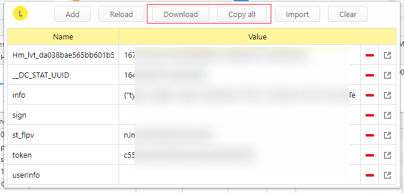

<!-- START doctoc generated TOC please keep comment here to allow auto update -->
<!-- DON'T EDIT THIS SECTION, INSTEAD RE-RUN doctoc TO UPDATE -->
**Table of Contents**  *generated with [DocToc](https://github.com/thlorenz/doctoc)*

- [localStorage 导入导出](#localstorage-%E5%AF%BC%E5%85%A5%E5%AF%BC%E5%87%BA)

<!-- END doctoc generated TOC please keep comment here to allow auto update -->

### localStorage 导入导出

可以考虑使用 Chrome
插件: [LocalStorage Manager](https://chrome.google.com/webstore/detail/localstorage-manager/fkhoimdhngkiicbjobkinobjkoefhkap)

在对应网站 例 `https://wap.showstart.com/` 点击这个插件，可以看到对应的 localStorage 信息 支持导入导出

对于命令行应用，可以 copy all 然后作为配置文件

重要的 key 是 sign 和 st_flpv，token 可以随机生成，userInfo 比较有用的是 userId，其他的可不理。